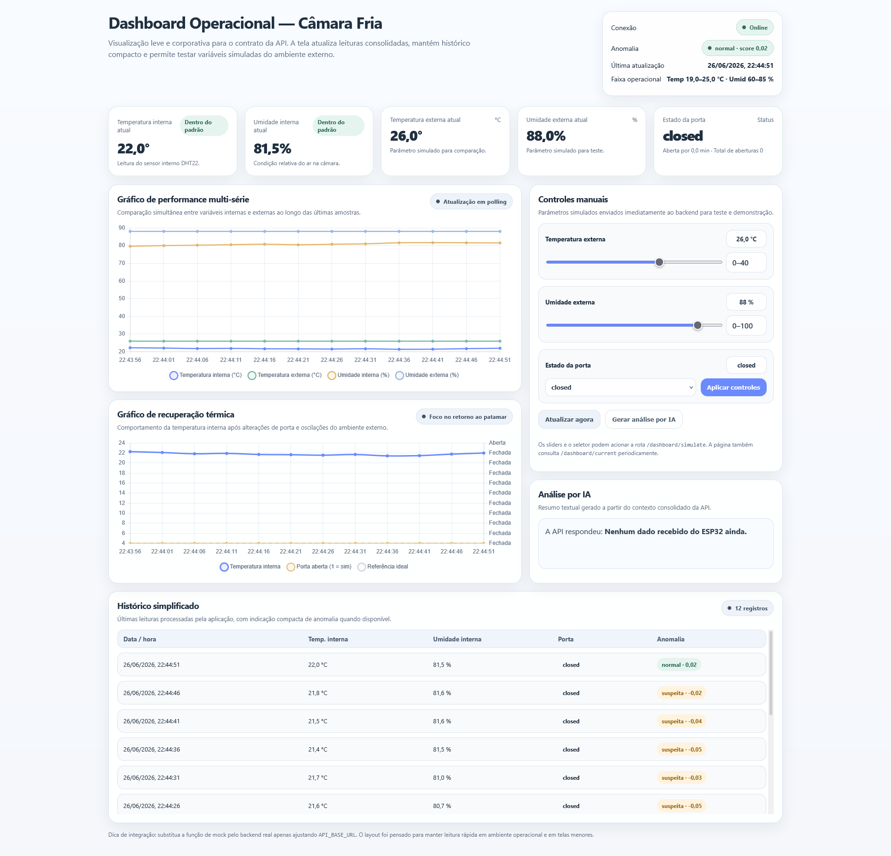
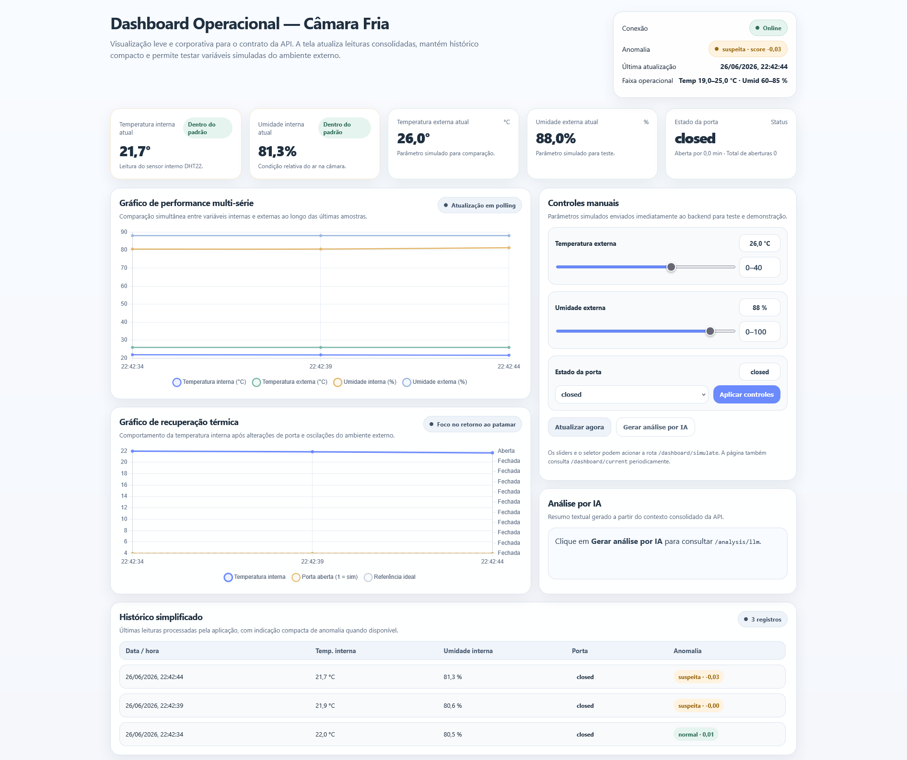
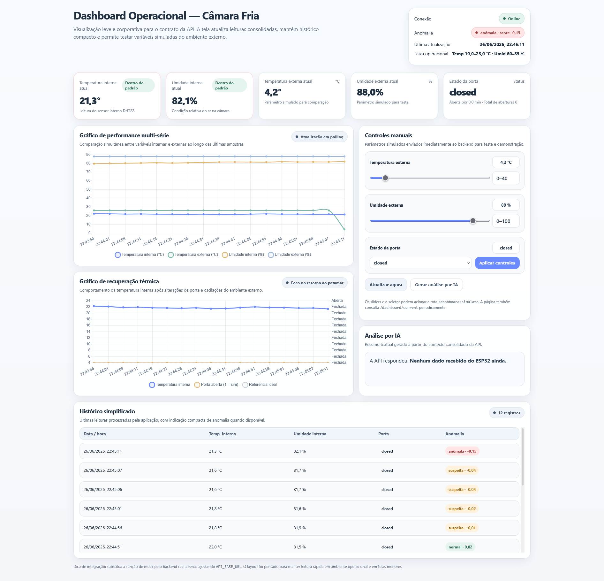
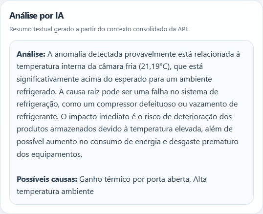

# Sistema de Monitoramento Inteligente de Câmara Fria

> Monitoramento IoT em tempo real com detecção de anomalias via Isolation Forest e análise por LLM.

---

## 📌 Visão Geral

O presente repositório é um sistema de monitoramento IoT para câmaras frias desenvolvido como projeto acadêmico. Um ESP32 com sensor DHT22 coleta temperatura e umidade internas a cada 10 segundos e envia os dados para uma API FastAPI, que aplica um modelo de Machine Learning (Isolation Forest) para classificar o estado da câmara em tempo real. Uma dashboard web exibe o estado consolidado e permite a um operador simular variáveis externas (temperatura ambiente, umidade e estado da porta). Uma análise em linguagem natural pode ser solicitada via integração com LLM.

### Funcionalidades

- Ingestão de dados via ESP32 + DHT22
- Detecção de anomalias com Isolation Forest treinado em dataset sintético calibrado para o clima da Mata Sul de Pernambuco (Palmares/PE)
- 10 features físico-contextuais: temperatura interna, umidade, delta térmico, resíduo de temperatura, taxa de variação, interação porta × temperatura e mais
- Análise de causa-raiz em linguagem natural via APIFreeLLM
- Dashboard single-page com modo de simulação integrado
- Simulador Python para testes sem o hardware físico

---

## 🏗️ Arquitetura

```
┌──────────────┐     POST /esp32/reading     ┌──────────────────────┐
│   ESP32      │ ─────────────────────────── │                      │
│   + DHT22    │  {temp_interna, umidade}     │   API FastAPI        │
└──────────────┘                              │   (Uvicorn)          │
                                              │                      │
┌──────────────┐     POST /dashboard/simulate │   ┌──────────────┐  │
│  Dashboard   │ ─────────────────────────── │   │  ML Service  │  │
│  (HTML/JS)   │ ←── GET /dashboard/current  │   │  (IF Model)  │  │
│              │ ←── GET /analysis/llm        │   └──────────────┘  │
└──────────────┘                              │                      │
                                              │   ┌──────────────┐  │
┌──────────────┐                              │   │  LLM Service │  │
│  Simulador   │ ─── POST /esp32/reading ─── │   │ (APIFreeLLM) │  │
│  (Python)    │                              │   └──────────────┘  │
└──────────────┘                              └──────────────────────┘
```

---

## 📁 Estrutura do Projeto

```

sistema-monitoramento-camara-fria/
├── README.md
├── .gitignore
│
├── api/                              # Backend FastAPI
│   ├── requirements.txt
│   └── app/
│       ├── main.py                   # Entrypoint + CORS
│       ├── core/
│       │   └── config.py             # Variáveis de configuração (pydantic-settings)
│       ├── api/
│       │   └── routes.py             # Definição dos endpoints
│       ├── schemas/
│       │   └── payloads.py           # Modelos Pydantic de request/response
│       ├── services/
│       │   ├── data_service.py       # Orquestra leituras e estado da câmara
│       │   ├── ml_service.py         # Carrega o modelo e avalia cada leitura
│       │   └── llm_service.py        # Integração com APIFreeLLM
│       └── model/                    # ← modelo treinado vai aqui
│           └── isolation_forest_model.joblib
│
├── firmware/
│   └── main.ino                      # Código Arduino para ESP32 + DHT22
│
├── frontend/
│   └── dashboard.html                # Dashboard single-page (Chart.js)
│
├── ml/                               # Notebook de treinamento do Isolation Forest
│   └── IsolationForest.ipynb
│
└── simulador/
    └── simulator.py                  # Simula o ESP32 via HTTP para testes
```

---

## 📸 Screenshots da Dashboard

### Visão Geral


### Suspeita de Anomalia


### Estado de Anomalia Detectada


### Análise por LLM


---

## 🤖 ML — Treinamento e Deploy do Modelo

O notebook `ml/IsolationForest.ipynb` gera o modelo que a API consome. O fluxo completo é:

### 1. Abrir o notebook no Google Colab

Abra o arquivo `ml/IsolationForest.ipynb` no Colab ou execute localmente com Jupyter. Instale as dependências se necessário:

```bash
pip install joblib scikit-learn pandas numpy matplotlib seaborn
```

### 2. Executar todas as células

O notebook irá:

1. Gerar um dataset sintético de 20.000 leituras com anomalias realistas (porta aberta, falha de compressor, degradação gradual)
2. Aplicar feature engineering contextual (`residual_temp`, `temp_delta`, `taxa_variacao_temp`, `interacao_porta_temp`)
3. Dividir temporalmente em 70% treino / 30% teste
4. Treinar um `Pipeline(StandardScaler + IsolationForest)` apenas nas amostras normais do treino
5. Avaliar com `classification_report`, matriz de confusão e ROC-AUC
6. Salvar o modelo em `/content/output/isolation_forest_model.joblib` (no Colab)

### 3. Copiar o modelo para a API

Após o treino, baixe o arquivo gerado e coloque-o em:

```
api/app/model/isolation_forest_model.joblib
```

A API carrega automaticamente esse arquivo ao iniciar via `ml_service.py`. Se o arquivo não existir, ela opera em **modo fallback** com heurísticas simples (porta aberta > 2 min + temperatura > 8°C).

### Features utilizadas pelo modelo

| Feature | Descrição |
|---|---|
| `temp_interna` | Temperatura interna da câmara (°C) |
| `umidade_interna` | Umidade relativa interna (%) |
| `porta_aberta_min` | Tempo acumulado com a porta aberta (min) |
| `temp_externa` | Temperatura ambiente externa (°C) |
| `umidade_externa` | Umidade relativa externa (%) |
| `hora_leitura` | Hora do dia em decimal (0.0 – 23.99) |
| `residual_temp` | Desvio da temperatura em relação ao valor esperado pelo modelo físico |
| `temp_delta` | Diferença entre temperatura interna e externa |
| `taxa_variacao_temp` | Média móvel das variações de temperatura (janela de 4 leituras ≈ 1 hora) |
| `interacao_porta_temp` | `porta_aberta_min × temp_interna` — suprime falso positivo de carga |

---

## 🚀 Rodando o Projeto

### Pré-requisitos

- Python 3.11+
- ESP32 com sensor DHT22 (ou use o simulador)

### 1. API (Backend)

```bash
cd api
pip install -r requirements.txt
uvicorn app.main:app --reload --host 0.0.0.0 --port 8000
```

A API estará disponível em `http://localhost:8000`.  
Documentação interativa: `http://localhost:8000/docs`

### 2. Dashboard (Frontend)

Abra diretamente no navegador:

```bash
# Linux / macOS
xdg-open frontend/dashboard.html

# Windows
start frontend/dashboard.html
```

Ou sirva com qualquer servidor estático. Por padrão, a dashboard aponta para `http://localhost:8000/api/v1`.

### 3. Simulador (sem hardware)

Com a API rodando, execute o simulador em outro terminal para enviar leituras sintéticas:

```bash
cd simulador
pip install requests
python simulator.py
```

O simulador envia uma leitura a cada 3 segundos com flutuações realistas de temperatura e umidade, usando como referência o clima de Palmares/PE em junho (~26°C, ~88% de umidade).

### 4. Firmware (ESP32 físico)

Edite as constantes no `firmware/main.ino`:

```cpp
const char* WIFI_SSID     = "SEU_WIFI";
const char* WIFI_PASSWORD = "SUA_SENHA";
const char* API_URL       = "http://SEU_IP:8000/api/v1/esp32/reading";
```

Compile e grave via Arduino IDE com as bibliotecas `WiFi`, `HTTPClient` e `DHT sensor library`.

---

## 🔌 Endpoints da API

| Método | Rota | Descrição |
|---|---|---|
| `POST` | `/api/v1/esp32/reading` | Recebe leitura real do hardware ESP32 |
| `POST` | `/api/v1/dashboard/simulate` | Atualiza variáveis externas simuladas (temperatura, umidade, porta) |
| `GET` | `/api/v1/dashboard/current` | Retorna o estado consolidado mais recente |
| `GET` | `/api/v1/analysis/llm` | Solicita análise em linguagem natural da última leitura via LLM |

### Exemplo — Enviando uma leitura

```bash
curl -X POST http://localhost:8000/api/v1/esp32/reading \
  -H "Content-Type: application/json" \
  -d '{"device_id": "esp32-01", "temperature_internal": 23.5, "humidity_internal": 81.0}'
```

**Resposta:**
```json
{
  "current": {
    "temperature_internal": 23.5,
    "humidity_internal": 81.0,
    "door_open_duration_minutes": 0.0,
    "door_open_count_total": 0,
    "temperature_external": 26.0,
    "humidity_external": 88.0,
    "door_state": "closed"
  },
  "anomaly": {
    "label": "normal",
    "score": 0.142
  },
  "thresholds": {
    "temp_min": 19.0,
    "temp_max": 25.0,
    "hum_min": 60.0,
    "hum_max": 85.0
  }
}
```

---

## 🛠️ Tecnologias

| Camada | Tecnologia |
|---|---|
| Hardware | ESP32 + DHT22 |
| Firmware | Arduino (C++) |
| Backend | FastAPI + Uvicorn + Pydantic |
| ML | scikit-learn (Isolation Forest + StandardScaler) + joblib |
| LLM | APIFreeLLM (via httpx assíncrono) |
| Frontend | HTML + Vanilla JS + Chart.js |
| Simulador | Python + Requests |

---

## 📄 Licença

Projeto acadêmico — IFPE Campus Palmares · Tecnólogo em Análise e Desenvolvimento de Sistemas.